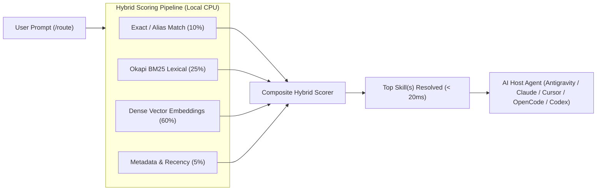

<div align="center" class="intro-header">

# Routed

**The Universal Local Router for Agent Skills**

[](https://opensource.org/licenses/MIT) [](https://github.com/bshea-1/Routed/releases) [](#installation)

</div>

<div align="center" class="quick-nav">

[Overview](#overview) | [Architecture](#architecture) | [Installation](#installation) | [Quick Start](#quick-start) | [Comparison](#comparison) | [Environments](#supported-environments) | [MCP & Local Models](#model-context-protocol-mcp--local-models) | [CLI](#cli-reference) | [FAQ](#faq) | [Star History](#star-history) | [License](#license)

</div><br>

<div class="mob-tip">

> [!TIP]
> Download standalone installers directly from [GitHub Releases](https://github.com/bshea-1/Routed/releases): `RoutedSetup.exe` (Windows), `RoutedSetup.pkg` (macOS), and `RoutedSetup.deb` (Linux).

</div>

---

## Overview

Routed is a **universal, local, zero-token router** for Agent Skills across AI coding environments. It automatically scans, indexes, and routes coding prompts to the most relevant skill using a local hybrid search engine combining Okapi BM25, exact matching, and local dense semantic embeddings.

- **Zero Token Cost**: Eliminates costly LLM routing calls (saving 1,000+ prompt tokens per interaction).
- **Sub-20ms Latency**: Local CPU-evaluated hybrid search responds instantly without network roundtrips.
- **Model Context Protocol (MCP) Server**: Run Routed via `routed mcp` to eliminate context pollution in LM Studio, Cursor, Claude Desktop, Windsurf, and Continue.
- **Native Multilingual Understanding**: Understands German, Spanish, French, Japanese, and 100+ languages natively, automatically handling compound words without language switches.
- **Privacy First**: Prompt routing is executed 100% locally; no user queries leave your machine.
- **Multi-Skill Dispatch**: Decomposes compound prompts and activates multiple skills simultaneously.

---

## Architecture

Routed evaluates queries using a multi-tier hybrid scoring pipeline running entirely on local CPU:



$$\text{Composite Score} = 0.60 \cdot \text{Semantic} + 0.25 \cdot \text{BM25} + 0.10 \cdot \text{Exact} + 0.05 \cdot \text{Metadata}$$

---

## Comparison

| Dimension | Routed (Local) | Traditional Cloud LLM Routing | Manual Skill Selection |
| :--- | :--- | :--- | :--- |
| **Token Cost** | $0.00 (Zero tokens) | 500 to 2,000 paid tokens | $0.00 |
| **Latency** | Under 20ms (Local CPU) | 1,200ms to 3,500ms network API | Manual human browsing |
| **Privacy** | 100% Local (Air-gapped) | Sends user prompts to cloud | Local |
| **Ranking Engine** | Deterministic Hybrid | Non-deterministic prompt drift | Memory or string grep |
| **Multi-Agent Sync** | Automatic adapter synchronization | Fragmented per-tool prompting | Manual copy and paste |

---

## Installation

| Platform | Installer Package | Format | Quick Install |
| :--- | :--- | :--- | :--- |
| **macOS** | [`RoutedSetup.pkg`](https://github.com/bshea-1/Routed/releases) / [`RoutedSetup.dmg`](https://github.com/bshea-1/Routed/releases) | Apple Installer / Disk Image | Run `.pkg` or mount `.dmg` |
| **Linux** | [`RoutedSetup.deb`](https://github.com/bshea-1/Routed/releases) / [`routed-linux-x64.tar.gz`](https://github.com/bshea-1/Routed/releases) | Debian Package / Tarball | `sudo dpkg -i RoutedSetup.deb` |
| **Windows** | [`RoutedSetup.exe`](https://github.com/bshea-1/Routed/releases) / [`Install-Routed.ps1`](https://github.com/bshea-1/Routed/releases) | NSIS Executable Installer | Run `RoutedSetup.exe` |

### Build from Source

```bash
git clone https://github.com/bshea-1/Routed.git
cd Routed
npm install
npm run build
npm run setup
```

---

## Quick Start

### 1. Interactive Setup Wizard
Run the setup wizard to detect installed AI coding tools and configure `/route` adapters:
```bash
routed setup
```

### 2. Discover & Index Skills
Scan local directories and build the hybrid index:
```bash
routed scan
routed skills
```

### 3. Route Prompts
Inside your AI agent chat (Antigravity, OpenCode, Claude Code, Cursor, Codex):
```text
/route write a unit test for my authentication service using TDD
```

Or from your terminal:
```bash
routed route "audit accessibility and fix memory leaks" --explain
```

### 4. Diagnostics
Verify system health, SQLite indices, and embedding models:
```bash
routed doctor
```

---

## Supported Environments

| Environment | Adapter Path / Target | Auto-Detection | Integration Method |
| :--- | :--- | :---: | :--- |
| **Model Context Protocol (MCP)** | `claude_desktop_config.json`, `.cursor/mcp.json` | Supported | Universal JSON-RPC 2.0 stdio server (`routed mcp`) |
| **LM Studio** | `~/.cache/lm-studio/mcp.json` | Supported | Local MCP server for GPU-hosted local LLMs |
| **Ollama** | `~/.ollama/routed/routed-tools.json` | Supported | Tool schemas (`/api/chat`) and dynamic Modelfiles |
| **Antigravity** | `~/.gemini/config/skills/route/SKILL.md` | Supported | Native skill dispatch and background router |
| **Claude Code** | `~/.claude/skills/route/SKILL.md` | Supported | Slash command integration and terminal runner |
| **Cursor** | `.cursor/rules/routed.mdc` / `mcp.json` | Supported | Rule-based prompt interception and MCP tools |
| **Codeium Windsurf** | `~/.codeium/windsurf/mcp_config.json` | Supported | Cascade MCP tool server |
| **Continue.dev** | `~/.continue/config.json` | Supported | Local IDE tool provider for Ollama and LM Studio |
| **OpenCode** | `~/.opencode/skills/route/SKILL.md` | Supported | Local skill loader and interactive prompts |
| **Codex** | `.agents/skills/route/SKILL.md` | Supported | Universal Agentic Skill schema |

---

## Model Context Protocol (MCP) & Local Models

Routed can be attached as a standard MCP server to any compatible host (LM Studio, Cursor, Claude Desktop, Windsurf, Continue). Instead of dumping 50+ tool schemas into your model context and exhausting VRAM, the host model only calls the `route_skill` tool. Routed evaluates the prompt on local CPU in sub-20ms and returns only the matched skill manifests.

### Add to Claude Desktop / Cursor / LM Studio
Add the following snippet to your host configuration file:
```json
{
  "mcpServers": {
    "routed": {
      "command": "routed",
      "args": ["mcp"]
    }
  }
}
```

### Direct Ollama Integration
Generate Ollama tool schemas for `/api/chat` function calling:
```bash
routed ollama tools
```

Route a prompt and generate a ready-to-run Ollama API payload:
```bash
routed ollama route "audit firestore security rules"
```

---

## CLI Reference

| Command | Description | Example |
| :--- | :--- | :--- |
| `routed setup` | Run interactive setup wizard | `routed setup` |
| `routed mcp` | Start Model Context Protocol server over stdio | `routed mcp` |
| `routed ollama <cmd>` | Ollama tool schemas, routes, and Modelfiles | `routed ollama tools` |
| `routed route "<prompt>"` | Find matching skill(s) for a prompt | `routed route "write unit test with TDD"` |
| `routed scan` | Scan supported environments and update index | `routed scan` |
| `routed skills` | List all discovered and indexed skills | `routed skills` |
| `routed adapters` | Manage `/route` adapters across AI tools | `routed adapters --install` |
| `routed doctor` | Run diagnostics and self-repair | `routed doctor --fix` |
| `routed reindex` | Incrementally re-index and re-embed skills | `routed reindex` |
| `routed watch` | Continuously monitor skill dirs for changes | `routed watch` |
| `routed feedback` | Manage routing preferences and corrections | `routed feedback --list` |
| `routed status` | Display status and detected environments | `routed status` |
| `routed benchmark` | Run routing accuracy and latency benchmarks | `routed benchmark` |
| `routed uninstall` | Safely remove Routed and clean adapters | `routed uninstall --dry-run` |

<details>
<summary>Click to view full CLI options</summary>

```text
Usage:
  routed <command> [arguments] [options]

Commands:
  setup               Run the interactive setup wizard
  route "<prompt>"    Find the best matching Agent Skill(s) for a prompt
  scan                Scan supported AI environments and update index
  skills              List all discovered and indexed skills
  adapters            Manage /route adapters across AI coding tools
  doctor              Run system, database, and model diagnostics (--fix to repair)
  reindex             Incrementally re-index and re-embed installed skills
  watch               Continuously monitor skill directories for file changes
  feedback            Manage local routing preferences and corrections
  uninstall           Safely uninstall Routed and remove adapters (--dry-run available)
  status              Display current system status and detected environments
  benchmark           Run routing benchmark suite and measure accuracy and latency
  version             Print version information
  help                Display help screen
```

</details>

---

## FAQ

<details>
<summary><strong>How does Routed operate with zero external API keys?</strong></summary>

Routed runs quantized ONNX dense embedding models (Snowflake Arctic Embed S / all-MiniLM-L6-v2) directly on local CPU alongside Okapi BM25. Vector similarity and text indices are cached in a local SQLite database, requiring no internet connection or cloud tokens.

</details>

<details>
<summary><strong>How are multiple skills selected simultaneously?</strong></summary>

When a prompt contains compound intents or conjunctions (such as "and", "with", "as well as"), Routed decomposes the prompt into sub-clauses, scores candidates across all clauses, and returns all matching skills in `selectedSkills` for joint agent activation.

</details>

<details>
<summary><strong>Does Routed introduce noticeable latency?</strong></summary>

No. Benchmark execution times average under 20 milliseconds on local CPU, making routing practically instantaneous compared to remote cloud roundtrips (1,200ms to 3,500ms).

</details>

<details>
<summary><strong>Where are skill embeddings and cache files stored?</strong></summary>

Routed stores its index and database files in standard platform directories:
- macOS: `~/Library/Application Support/Routed`
- Linux: `~/.local/share/routed`
- Windows: `%LOCALAPPDATA%\Routed`

</details>

---

## Star History

<div align="center">

[](https://github.com/bshea-1/Routed/stargazers)

<p><em>Real-time stargazer history powered directly by the GitHub Stargazers History API.</em></p>

</div>

---

## License

MIT License. Copyright (c) 2026 bshea-1.

See [LICENSE](LICENSE) for full details.
